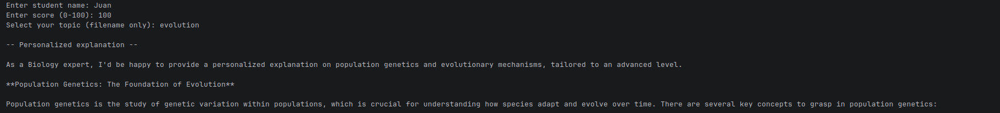

# XCool Brain


AI knowledge architecture for Adaptive Science Curriculum. (Proof‑of‑concept prototype demonstrating early functionality and design exploration.)



## What It Does & Features

- Built a structured domain knowledge graph for Grade 8 to 12 Science

- Designed "context packs" per topic (concepts, misconceptions, examples, assessment styles)

- LLM generates:

    - Explanations at different difficulty levels
    
    - Socratic questioning paths
    
    - Practice questions with adaptive hints
    
    - Integrated mastery tracking

## Tech Architecture:

- LLM orchestration layer

- Vector DB (context reinforcement)

- Knowledge graph structure

- Adaptive difficulty engine

- User state model

## Installation

Install Ollama
```BASH
curl -fsSL https://ollama.com/install.sh | sh
```

Pull llama3
```BASH
ollama pull llama3.2
```

Update system config
```BASH
sudo nano /etc/systemd/system/ollama.service
```

Edit or add this text, this will expose your ollama
```TEXT
# under [Service]
Environment="OLLAMA_HOST=0.0.0.0:11434"
```

Restart ollama
```BASH
sudo systemctl daemon-reload
sudo systemctl restart ollama
```

Add or update context packs in ./context_packs/custom.json using the sample files as format reference.

Move or rename .env.example and update

```BASH
docker compose up -d
docker exec -it xcool /bin/bash
python3 main.py
```

## Contributing

Contributions are welcome! Please follow these steps:

1. Fork the repository.
2. Create a new branch (git checkout -b feature/your-feature).
3. Commit your changes (git commit -m 'Add your feature').
4. Push to the branch (git push origin feature/your-feature).
5. Open a Pull Request.

Please ensure your code follows the project's coding standards and includes relevant tests.

## Hire Me

```
If you like this project and need help with development, customization, or integration, feel free to reach out!

I’m available for freelance work, consulting, and collaboration.

Thank you for checking out XCool Brain AI Knowledge!
Feel free to contribute or open issues.
```
